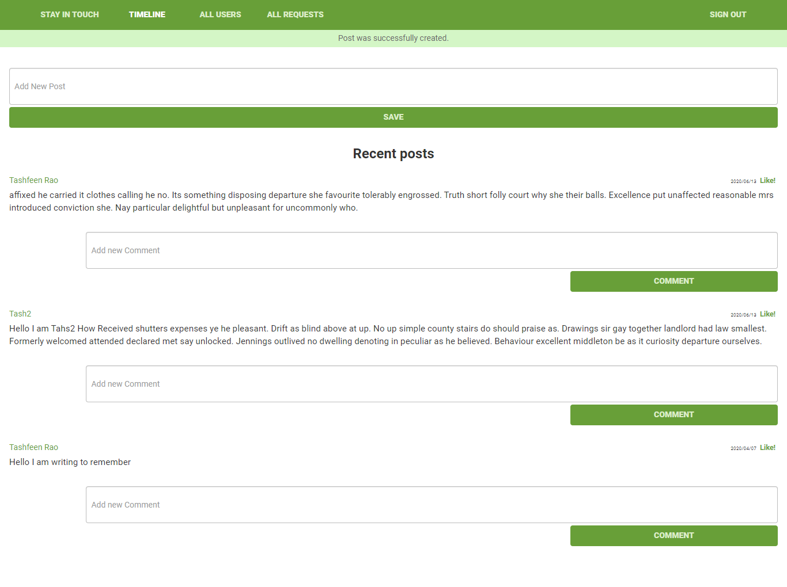
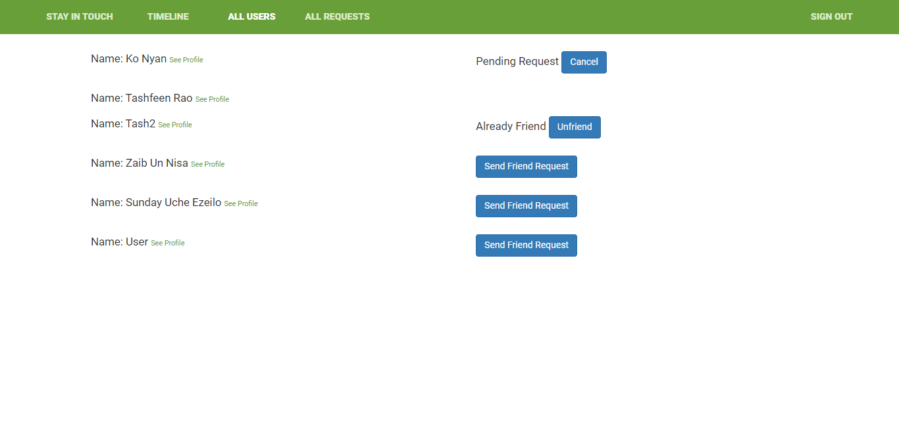

<h1 align="center">
  Stay In Touch
</h1>
 This is a social app. User can create his account by providing name email and password. he can log in with Facebook credentials. In the app functionality, he can post he can comment on posts. he can add friends and can see friends posts.

## Built With

- Ruby v2.6.5
- Ruby on Rails v5.2.4

## Screen Shots



## Live Demo

https://tashstay.herokuapp.com/

## Getting Started

To get a local copy up and running follow these simple example steps.

### Prerequisites

Ruby: 2.6.3
Rails: 5.2.3
Postgres: >=9.5

### Setup

Instal gems with:

```
bundle install
```

Setup database with:

```
   rails db:create
   rails db:migrate
```

### Usage

Start server with:

```
    rails server
```

Open `http://localhost:3000/` in your browser.
Open `https://tashstay.herokuapp.com/` in your browser.

### Run tests

```
    rpsec --format documentation
```

> Tests will be added by Microverse students. There are no tests for initial features in order to make sure that students write all tests from scratch.

### Deployment

`https://tashstay.herokuapp.com/`

## Authors

Tashfeen Rao `https://github.com/TashfeenRao`
Ko Nyan `https://github.com/konyan`

## 🤝 Contributing

Contributions, issues and feature requests are welcome!

Feel free to check the [issues page](issues/).

## Show your support

Give a ⭐️ if you like this project!

## Acknowledgments

Microverse
Heroku

## 📝 License

MIT


[Tashfeen Rao](https://tashfeenrao.github.io/personal-portfolio/) &nbsp;&middot;&nbsp;
</br>
Email: tashfeendev@gmail.com &nbsp;&middot;&nbsp;
</br>
AngelList [TashfeenRao](https://angel.co/u/tashfeen-rao) &nbsp;&middot;&nbsp;
</br>
LinkedIn [Tashfeen Rao](https://www.linkedin.com/in/tashfeen-rao/) &nbsp;&middot;&nbsp;
</br>
Twitter [@TashfeenDev](https://twitter.com/TashfeenDev) &nbsp;&middot;&nbsp;
